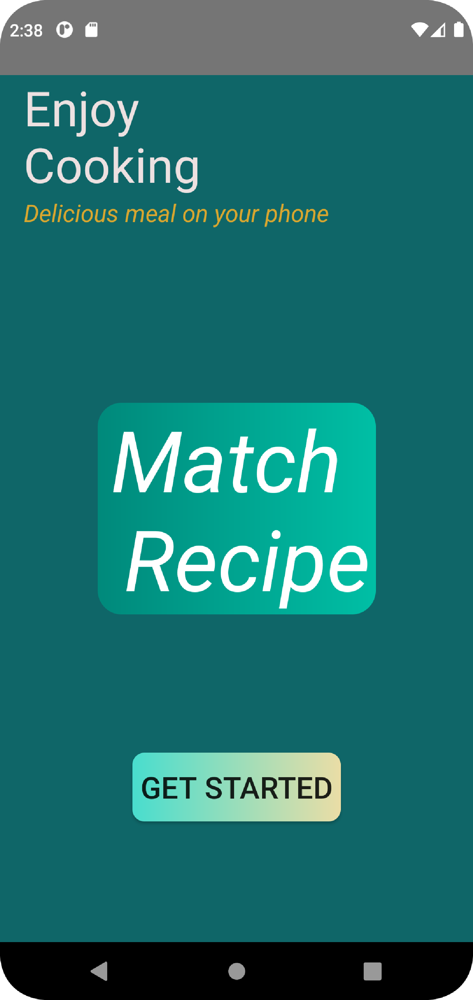
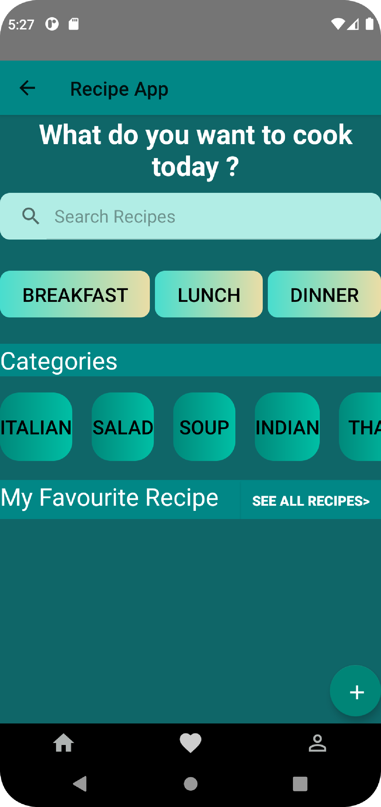
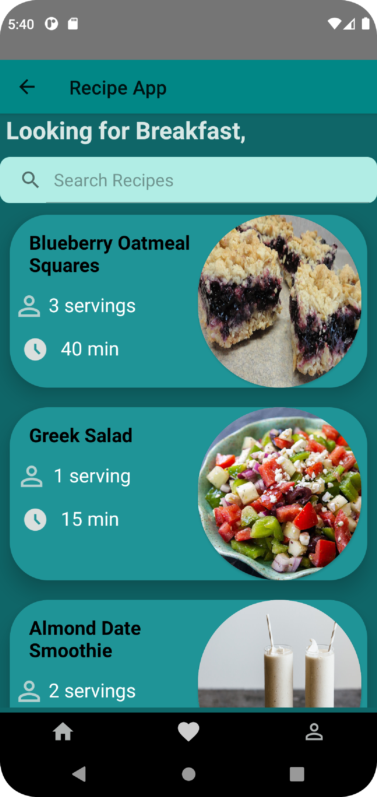
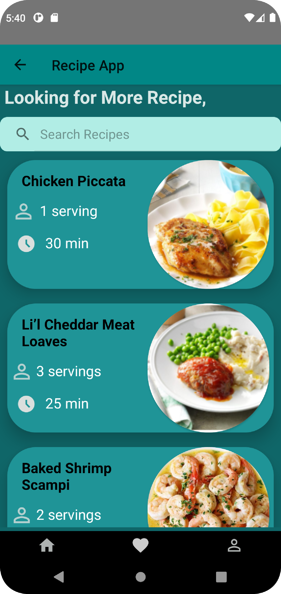
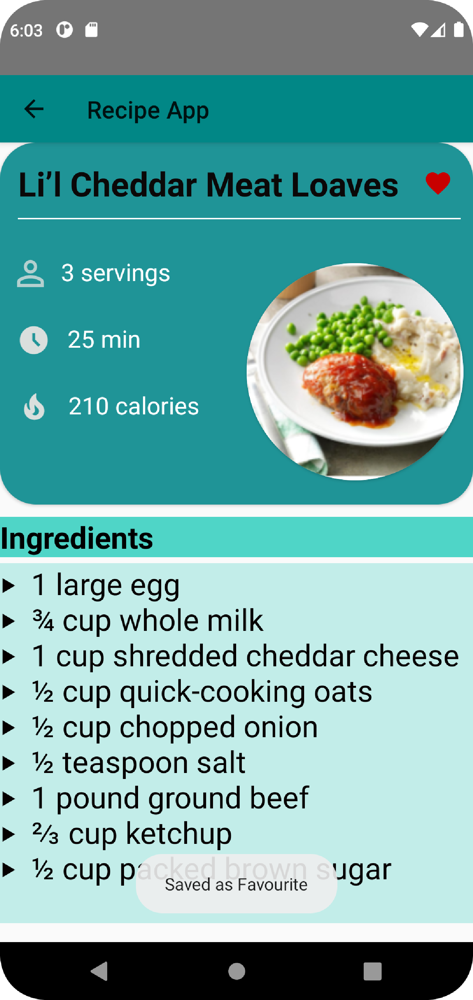
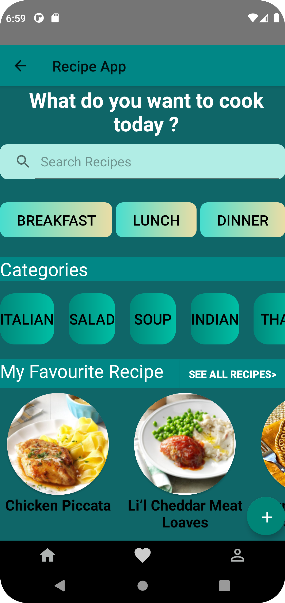
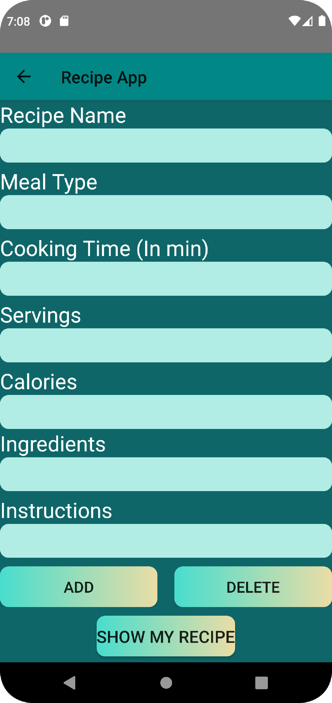
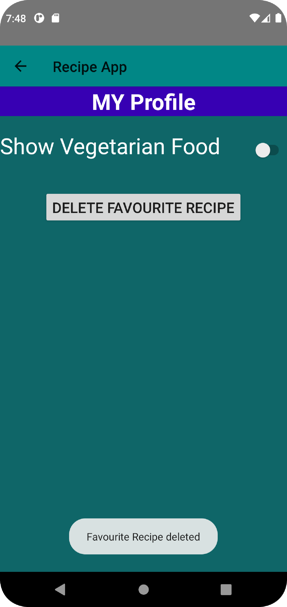
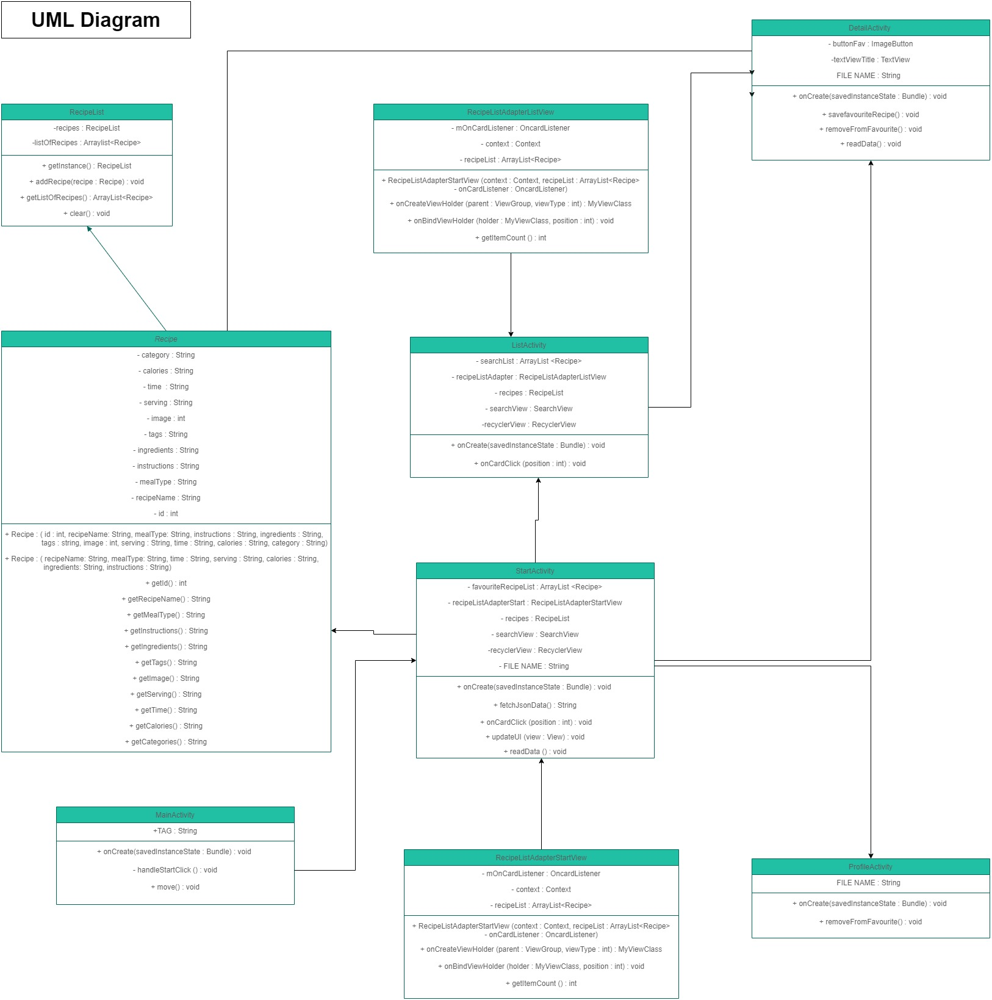

# Recipe app
This recipe app has been implemented during the mobile course

# Members
*  Ainara Larrañaga
*  Prabin Dhakal
*  Thuy Ta

# Project description
This is an android app where the user can select or type the ingredients that are currently available in the kitchen or fridge so that way it will match them with recipes that have those ingredients. Our project consists of making our MatchRecipe App a fun way to cook while learning new recipes, easy to use and free. Our goal is to make the MatchRecipe App useful and helpful for busy parents, remote workers, new cooks and anyone who is interested in cooking new recipes.

# User stories
- Choose the recipe from the recipe list.
- Search a recipe /ingredient.
- Offer the list of the most popular recipes.
- Come back to the home page to continue finding recipes.
- Save user’s favorite recipes to use it in next time.
- Add and remove user’s recipes.

# User guide
- Users can use the app without registeration. When the user opens the app, they will have an option to choose between breakfast, lunch and dinner. 
- After selecting the right choice, users will be served with two different options.
- They can either select the ready-made recipes offered by the app or they will have an option to type the name of ingredients or simply select from the ingredients categories and the app will show the recipes that match the ingredients.
- Once the user finds the recipe of their choice,  they can follow the step by step instructions for it. 
- Alternatively, if the user already knows what they are looking  for, they can search for the specific recipes from the search bar.
- User will be offered with the favourites button where the users can save their favourite recipe. So, the users don't have to search for the same recipe when they open the app again.
- Also, user will have an option to contribute to the application. The user can add or delete a recipe and the app will guide them to the recipe creation process.

# Test Case Document and Javadoc
[Java Doc](https://users.metropolia.fi/~prabind/javadoc/)
 
[Test case document](https://docs.google.com/document/d/15MCwdpB8n1kPm5es9Wj7HebcLWm0WS2cjwCa80m3sRw/edit)

# Reference
[Android Internal Storage](https://www.youtube.com/watch?v=cGxHphBjTBk&ab_channel=slidenerd)
 
[Javadoc Instructions](https://www.geeksforgeeks.org/what-is-javadoc-tool-and-how-to-use-it/)
 
[Recipes.json](https://github.com/raywenderlich/recipes/blob/master/Recipes.json)
 
[How to parse JSON data from asset folder in Android](https://www.youtube.com/watch?v=ZJepo2wRiBk)
 
[How to filter a RecyclerView with SearchView](https://www.youtube.com/watch?v=sJ-Z9G0SDhc&t=132s)
 
[ Search functionality for RecyclerView](https://www.youtube.com/watch?v=nlPtfncjOWA&t=393s )
 
[Custom buttons design - Android Studio tutorial](https://www.youtube.com/watch?v=nlPtfncjOWA&t=393s)
 
[Splash screen](https://youtu.be/TGQ0mlFDIrk)
 
[UML generation](https://plugins.jetbrains.com/plugin/15124-uml-generator )
 
[Chicken Piccata](https://www.tasteofhome.com/recipes/quick-chicken-piccata/)
 
[Li’l Cheddar Meat Loaves](https://www.tasteofhome.com/recipes/li-l-cheddar-meat-loaves/)
 
[Tomato Basil Soup](https://thecozyapron.com/tomato-basil-soup/)
 
[Curried Rice and Red Lentils](https://kalynskitchen.com/curried-rice-and-red-lentils-best/)
 
[Curry Chicken Salad](https://cleanfoodcrush.com/curry-chicken-salad/)
 
[Greek Salad](https://www.simplyrecipes.com/recipes/dads_greek_salad/)
 
[Almond Date Smoothie](https://downshiftology.com/recipes/cashew-date-shake-vegan-paleo/)
 
[Mediterranean Scramble](https://www.aheadofthyme.com/2016/02/mediterranean-scrambled-eggs-with-spinach-tomato-and-feta/)
 
[Sweet Mashed Potatoes](https://cookieandkate.com/savory-mashed-sweet-potatoes/)
 
[Pasta](https://yummynotes.net/the-best-tomato-pasta-recipe/)
 
[Vegetable Fried Rice](https://www.thespruceeats.com/vegetable-fried-rice-695042)
 
[Sweet Sticky Rice](https://www.allrecipes.com/recipe/150313/thai-sweet-sticky-rice-with-mango-khao-neeo-mamuang/)

# App UI

 

 

# UML Diagram

